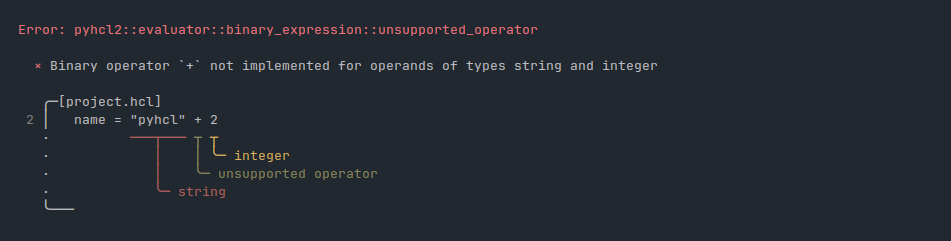

# pyagnostics

`pyagnostics` is a fancy diagnostics & error reporting library for Python.

## Acknowledgements

This project was heavily inspired by:
- [miette](https://github.com/zkat/miette), a diagnostic library for Rust.
- [ariande](https://github.com/zesterer/ariadne), a fancy compiler diagnostics crate.
